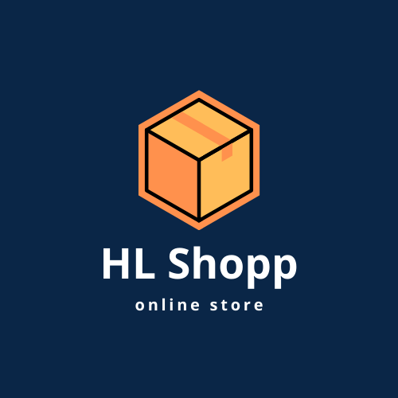

# Ecommerce HL Shopp 


 Neste projeto, foi criado um site de comércio eletrônico com Next.js 14, abordando ações do servidor, Prisma, segurança com Next-Auth, MongoDB, Google Login e recursos como carrinhos anônimos. A interface será aprimorada com TailwindCSS e DaisyUI. A implantação no Vercel, otimização de metadados, caching com React e ferramentas de desenvolvedor são abordados para facilitar a jornada de codificação.

## Stacks utilizadas ##

### FRONT-END ###

- [DaisyUI](https://daisyui.com/)
- [TypeScript](https://www.typescriptlang.org/)
- [Tailwind CSS](https://tailwindcss.com/)
- [Next.js](https://nextjs.org/)

### BACK-END ###

- [Node.js](https://nodejs.org/)
- [Prisma](https://prisma.io/)
- [Next.js](https://nextjs.org/)
- [Next-Auth](https://next-auth.js.org/)
- [Google login](https://next-auth.js.org/providers/google)
- [TypeScript](https://www.typescriptlang.org/)

### BANCO DE DADOS ###

- [MongoDB](https://www.mongodb.com/pt-br)

### DEPLOY ###

- [Vercel](https://vercel.com/new?utm_medium=default-template&filter=next.js&utm_source=create-next-app&utm_campaign=create-next-app-readme)

## Clonando e executando o app ##

 1. Clone o repositório usando o comando:

```bash
git clone https://github.com/Humberto08/ecommerce-hl_shopp-nextjs.git
```

2. Instale as dependências do Backend:

```bash
npm install
```


3. Certifique-se de configurar as variáveis de ambiente essenciais para o projeto.

```bash
npm run dev
```

Abra [http://localhost:3000](http://localhost:3000) abra seu navegador e veja o resultado.


## Funcionalidades

- Ações do servidor Next.js: O projeto aproveita as capacidades do servidor Next.js para renderização de páginas no servidor, melhorando o desempenho e a otimização do SEO.
- Gerenciamento de bancos de dados com Prisma: O Prisma é utilizado para gerenciar bancos de dados, permitindo a criação, leitura, atualização e exclusão de dados no sistema.
- Segurança do usuário com Next-Auth, MongoDB e login do Google: A segurança do usuário é uma prioridade, e o Next-Auth é usado para autenticação de usuário. Além disso, o projeto integra o MongoDB para o armazenamento de dados sensíveis e permite o login com contas do Google.
- Carrinhos de compras anônimos: Os usuários podem adicionar produtos a um carrinho de compras, mesmo antes de fazer login, oferecendo uma experiência amigável e intuitiva. 
- Interface de usuário excelente via TailwindCSS e DaisyUI: O projeto utiliza o TailwindCSS e o DaisyUI para criar uma interface de usuário atraente e responsiva, garantindo uma experiência de compra agradável.
- Implantação no Vercel: O Vercel é escolhido como plataforma de implantação, permitindo uma implantação fácil e escalabilidade.
- Otimização de metadados de página: A otimização de metadados de página é realizada para melhorar o SEO e a visibilidade nos mecanismos de busca.
- Simplificação de solicitações Prisma com cache React: A otimização de solicitações Prisma é alcançada por meio do cache React, melhorando o desempenho e a eficiência.


```

## Autores

- [Humberto Luciano](https://www.github.com/humberto08)